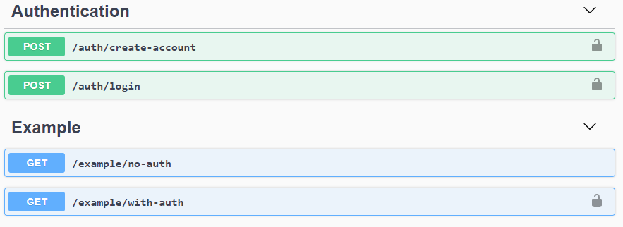
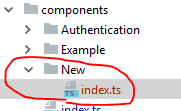
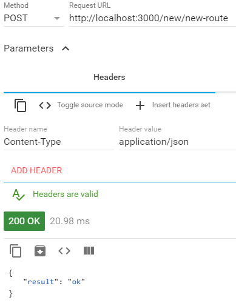
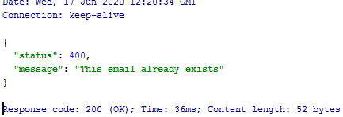

# Node-Express-Orm-TypeScript-Template
Simple Node.js, Express, TypeScript, Sequelize Orm app api template with proper documentation to get started.

Goal of this repository is to build simple well documented TypeScript based Node.JS Express application api 
which is easy and fast base for agile api development when time is limited. It's <b>work in progress</b>.

It's not only meant to be api but also application running tasks with node-scheduler. 
I am personally using tasks to update specific database information while serving api for 
front end applications. 

--------------------
Table of contents
=================
* [Sources](#sources)
* [Version Notes](#version-notes)
* [Installation](#installation)
    * [Package setup](#package-setup)
    * [Environment settings](#environment-settings)
    * [Start dev server](#start-dev-server)
* [Documentation](#documentation)
    * [Beginning](#beginning)
    * [Adding new route](#adding-new-route)
    * [Route authentication](#route-authentication)
* [Calling routes](#calling-routes)
* [Authors](#authors)
* [Contributors](#contributors)

--------------------

Sources
============
I originally used api generator from this [source](https://github.com/ChechaValerii/node-typescript-mongodb).
I found this initially complicated to get started with if no proper experience with TypeScript API's. 
I later added different structure, https and scheduled tasks support. 

Version notes
============
At the time of writing this TypeScript used was on version: <b>3.9.5</b>


Installation
============

Package setup
-----

Run following commands one at the time, once.  
Lines have comments explaining basics what these packages do.  
`npm -g` means global installation basically working from CLI, it's same as giving `--global` flag.

```bash
npm install -g nodemon          # Needed to listen for changes when developing
npm install -g ts-node          # Allows you to run TypeScript in Node. js directly, without having to run the files through the TypeScript compiler (tsc), first
npm install -g typescript       # TypeScript is a language for application-scale JavaScript, it's language you are using for development here.
npm install                     # Installs all dev/dependencies from packages.json file.
```

Environment settings 
-----
Next create `.env` file using `.env_template` contents as example.  
Place this file in same folder as template file already is.

Start dev server
-----
Run following command

```bash
nodemon
```

Result should look like this:
  


Open web browser and navigate to `http://localhost:3000/` depending of port you set at `.env` file.


Documentation
============

Beginning
-----

See `nodemon.json` file at the root of this project. Inside there you find reference to file `/src/index.ts`

Server `index.ts` is where all begins. It works with following components:

<b>index.ts</b>
```text
dbTools                # Checks database existence, creates it if not based on .env details
createServer           # Either http or https controlled by .env file, production use https with valid cert like letsencrypt
eventHandlers          # Functions which are triggered on specific events like on error event.
app                    # Leads to /src/app/ structure. Open index.ts there to specify tasks.
```

<b>server.ts</b>
```text
express             # creates express app
middleware          # load middleware, this is explained more later
routes              # This is where your routes like /book/get are described and then logic is behind this
process variables   # At server.ts app get's set it's process variables, loaded from .env file or set as default if not specified
```

<b>middleware.ts</b>  
Middleware has following functions:
```text
bodyparser          # Parse incoming request bodies in a middleware before your handlers, available under the req.body property.
cookieParser        # Parse Cookie header and populate req.cookies with an object keyed by the cookie names.
compression         # Attempt to compress response bodies for all request that traverse through the middleware, based on the given options.
helmet              # Helps you secure your Express apps by setting various HTTP headers.
cors                # Connect/Express middleware that can be used to enable CORS with various options.
sendHttpErrorModule # Custom request filter to send error code on non valid request. 
logRequestPaths     # Live logging requested paths, can be disabled since console logging is synchronous, meaning that it affects performance.
```

Adding new route
-----

Adding new router or route starts from `/routes` folder via copy paste existing router like `ExampleRouter.ts` 
to a new name like `NewRouter.ts`


Then you need to create new component which has required method logic 



Inside `index.ts` has again copy pasted content from Example component which is returning json result ok for post request


Now go to following index.ts file under `/routes` folder


At the routes index file you create base route for your new `NewRouter` route like this:


Also you need to import this `NewRouter`


Since this is post method which was defined at `NewRouter.ts`, result will be for post request:




Route authentication
-----

See `ExampleRouter.ts` for good example how you can define part of route under authentication.  


This means that you can access `http:localhost:port/example` without authentication and then define under this path 
which components require authentication.

Or you define whole in this case `http:localhost:port/new` route requiring always authentication no matter
which method is called behind it.  


Calling routes
============
There is a file called `ApiTesting.http` included in root of this project. 
That file can be run at least on Intellij IDE's having integrated REST client like Postman.





Authors
============

* **Norkator** - *Initial work* - [norkator](https://github.com/norkator)


Contributors
============

None so far.
